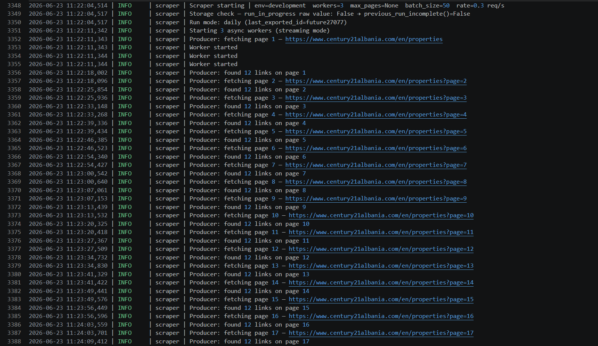
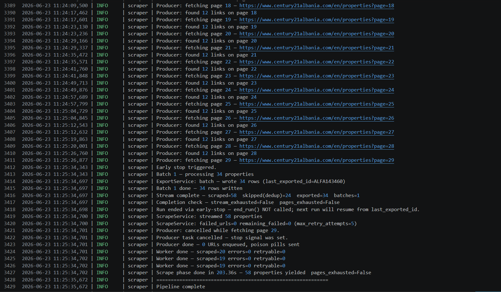
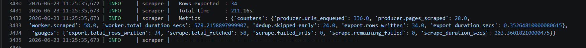
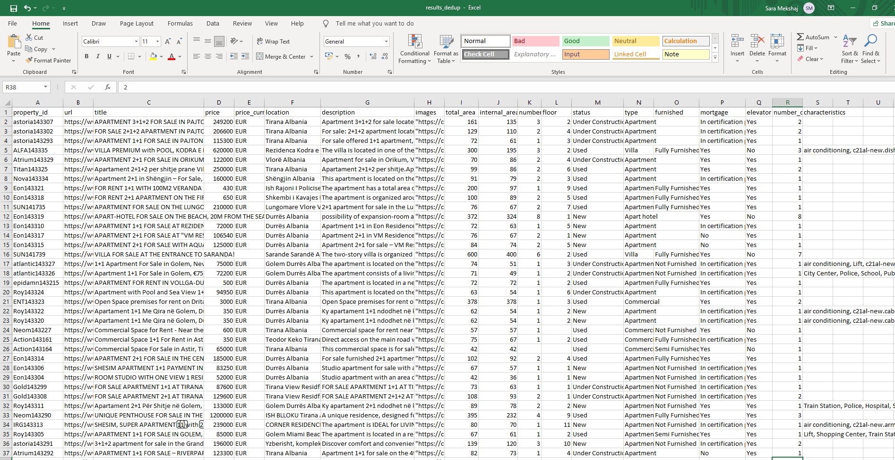

# Production-Grade Real Estate Scraper
**Python • Playwright • AsyncIO • Fault-Tolerant Architecture**

A fault-tolerant web scraping system designed to collect thousands of property listings from Century21 Albania website while handling interruptions, rate limits, browser crashes, and duplicate data automatically.


---

## Project Highlights

- Collected **12,530 unique property listings**
- Crawled **1,049 listing pages**
- Discovered **12,585 property URLs**
- Recovered **203 / 204 failed URLs (99.5%)**
- Supports resumable long-running crawls
- Incremental daily updates
- Concurrent asynchronous architecture
- Automatic failed URL retry pipeline
- Duplicate prevention and validation

---
## Overview

This scraper was built to handle real-world scraping challenges that simple script typically ignore:

- Browser crashes
- Network instability
- Long-running jobs
- Rate limiting
- Interrupted executions
- Duplicate data
- Incremental updates

The system uses Playwright for JavaScript-rendered content and AsyncIO
for concurrent processing while maintaining persistent state across runs.

---
### Target Website

| Property           | Value             |
| ------------------ | ----------------- |
| Website            | Century21 Albania |
| Category           | Real Estate       |
| Content Type       | Dynamic           |
| Pagination         | Next Page         |
| Listings per Page  | 12                |
| Total Pages        | 1000+             |
| Estimated Listings | 12,000+           |


---
## Performance

Results from a full production crawl of Century21 Albania.

| Metric                       | Value               |
| ---------------------------- | ------------------- |
| Total Pages Crawled          | 1,049               |
| Property URLs Discovered     | 12,585              |
| Unique Properties Collected  | 12,530              |
| Crawl Duration               | 11.9 hours          |
| Average Throughput           | 17.6 properties/min |
| Failed URLs During Crawl     | 213                 |
| Failed URLs Recovered        | 203                 |
| Permanently Unavailable URLs | 1                   |
| Recovery Rate                | 99.5%               |
| Duplicate Records Removed    | 14                  |
| Resume Support               | Yes                 |
| Incremental Crawling         | Yes                 |

### Reliability Results

During the initial crawl, 213 property pages could not be scraped because of temporary network issues, server-side failures, or transient website conditions.

A dedicated retry pipeline later reprocessed those failed URLs independently from the main crawl:

* 204 URLs retried
* 203 recovered successfully
* 1 permanently unavailable (listing removed from the website)

This produced a recovery rate of approximately **99.5%**, allowing the final dataset to reach **12,530 unique properties** without requiring a full re-crawl.

The scraper also supports:

* Resuming interrupted runs from checkpoints
* Recovering failed URLs independently
* Incremental crawling of newly published properties
* Automatic duplicate detection
* Browser crash recovery
* Adaptive rate limiting

### Incremental Crawling Example

After the initial historical crawl is completed, subsequent executions collect only newly published properties.

Example daily run:

| Metric                      | Value       |
| --------------------------- | ----------- |
| Pages Visited               | 28          |
| Properties Examined         | 58          |
| Previously Known Properties | 24          |
| Newly Discovered Properties | 34          |
| Failed URLs                 | 0           |
| Runtime                     | 3.5 minutes |

The scraper automatically stopped after reaching previously exported records, avoiding unnecessary requests to older pages.

This reduced the crawl scope from over 1,000 pages to only 28 pages while still collecting all newly published listings.

---
## Architecture
```text

Page Producer
      │
      ▼
 URL Queue
      │
      ▼
Async Workers
      │
      ├── Retry Policy
      ├── Rate Limiter
      ├── Circuit Breaker
      │
      ▼
Result Queue
      │
      ▼
Scraper Engine
      │
      ├── Deduplication
      ├── Checkpoint Store
      ├── Failed URL Store
      │
      ▼
CSV Export
```

---

## Project Structure

```text
app/
├── abstraction/
├── client/
├── config/
├── container/
├── crawler/
├── exporters/
├── mappers/
├── models/
├── normalizers/
├── orchestration/
├── pagination/
├── parsers/
├── services/
├── storage/
├── utils/
├── validators/
└── workers/

monitoring/
tests/
output/
```

---
## Reliability Features

### Retry Strategy

Failed requests are automatically retried using exponential backoff and randomized jitter.

### Circuit Breaker

Protects the scraper from repeatedly hitting unstable or rate-limited targets.

### Checkpoint Recovery

Allows interrupted scraping jobs to resume from the last successful checkpoint.

### Failed URL Pipeline

Transient failures are stored and automatically retried in subsequent runs.

## Challenges Solved

- **Rate limiting and temporary outages** – Implemented a shared token-bucket rate limiter, exponential backoff with jitter, and a circuit breaker to avoid overwhelming the target site and recover gracefully from 429 and server errors.

- **Crash recovery and resumability** – Added checkpointing and persistent deduplication so interrupted runs can resume without losing previously exported data or re-scraping completed properties.

- **Incremental crawling** – Designed the scraper to distinguish between completed and interrupted runs, enabling daily executions to fetch only newly added properties while automatically revisiting unfinished crawls.

- **Failed request recovery** – Built a persistent failed-URL store and a standalone retry pipeline that selectively reprocesses retryable URLs without restarting the entire crawl.

- **Duplicate prevention** – Implemented two-stage deduplication that skips already exported properties both before and after fetching detail pages, reducing bandwidth and processing time.

- **Long-running scraper reliability** – Added run-state tracking and page-exhaustion detection to prevent incomplete runs from being mistakenly treated as successful.

- **Scalable state storage** – Scalable state storage – Storage abstraction designed to support future JSON, SQLite, and Redis backends.


---

## Engineering Decisions

### Why Playwright instead of Requests?
- Century21 renders listing data through JavaScript.
-Playwright executes browser-side JavaScript, allowing reliable extraction
of dynamically loaded content that is unavailable in the initial HTML response.

### Why AsyncIO?
- Property pages are I/O bound.
- Using asynchronous workers allows hundreds of requests to remain in-flight
without blocking threads, significantly improving throughput.

### Why a Circuit Breaker?
- When the target site starts returning repeated failures,
- the circuit breaker temporarily pauses requests instead of continuously
hammering the server, reducing wasted retries and improving recovery.


---
## Core Features

### High Performance
- Async workers
- Streaming pipeline
- Queue-based processing

### Fault Tolerance
- Retry policies
- Circuit breaker
- Resume support

### State Management
- Checkpoints
- Failed URL store
- Export history

### Observability
- Structured logs
- Metrics
- Progress tracking

---

## Example Extracted Data

```json
{
  "property_id": "vision135100",
  "url": "https://www.century21albania.com/en/property/5463866/toke-me-qira-ne-vilun-velipoje-255-m2-vision135100.html",
  "title": "Land for Rent in Vilun, Velipojë | 255 m²",
  "price": "500.0",
  "currency": "EUR",
  "location": "Shkodër Albania",
  "description": "This land is available for rent in the Viluni area, Velipojë, offering a space of 255 m².• Price: 500 euros per month• Suitable for various uses according to your needs• For more information, please contact us!",
  "images":"https://crm-cdn.ams3.cdn.digitaloceanspaces.com/c21al/storage/c21al/2026/March/week2/1024x768/1292369_Velipoje-Albania-1.jpg",
  "total_area": 255,
  "internal_area": 255,
  "number_of_bedrooms": None,
  "floor" : None,
  "status": "Used",
  "type":"Land",
  "furnished": None,
  "mortgage":"Yes",
  "elevator": None,
  "number_of_toilets": None,
  "characteristics": "newar the beach, view to beach",
}
```
---

## Tech Stack
* Python 3.12+
* AsyncIO
* Playwright
 Pydantic

---
## Installation

```bash
git clone https://github.com/SaraMekshaj1/real-estate-scraper-http-playwright.git
cd real-estate-scraper-http-playwright
python -m venv venv
venv\Scripts\activate
python -m pip install -r requirements.txt
playwright install

---
## Running the Scraper

```bash
python main.py
```

---

## Engineering Highlights

This project demonstrates practical implementation of:

* Async Producer-Consumer Pattern
* Dependency Injection
* Factory Pattern
* Strategy Pattern
* Circuit Breaker Pattern
* Repository Pattern
* Streaming Data Pipelines
* Incremental Crawling
* Fault-Tolerant Processing
* Multi-Backend Storage Design


---
## Screenshots

### Scraping Progress in a daily run





### Exported Dataset




## Disclaimer

This project is intended for educational and portfolio purposes.

Users are responsible for ensuring compliance with the target website's Terms of Service, robots.txt policies, and applicable laws before running the scraper.

---

## Author

**Sara Mekshaj**

Python Developer | Web Scraping Engineer

Specializing in:
• Playwright Automation
• AsyncIO Scraping Systems
• Fault-Tolerant Data Pipelines
• Data Extraction & ETL
